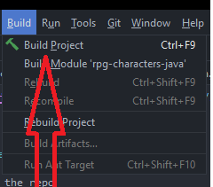

<details>
  <summary>Table of Contents</summary>
  <ol>
    <li>
      <a href="#about-the-project">Rpg-characters</a>
      <ul>
        <li><a href="#built-with">Built With</a></li>
      </ul>
    </li>
    <li>
      <a href="#getting-started">Getting Started</a>
      <ul>
        <li><a href="#prerequisites">Prerequisites</a></li>
        <li><a href="#installation">Installation</a></li>
      </ul>
    </li>
    <li><a href="#app-overview">App Overview</a></li>
    <li><a href="#contact">Contact</a></li>
  </ol>
</details>

## RPG Characters

A console based demo application made to creating characters. 

You can select a class such as Mage, Ranger, Rogue and Warrior. 

With your character, you can do a couple of actions to build up your character.

## Built with

- Java
- JUnit

## Getting Started

### Prerequisites

[Intellij IDEA](https://www.jetbrains.com/idea/) or any other editor.


### Installation

1. Clone the repo
    ```sh
    git clone https://github.com/sebastianborjesson/rpg-characters-java.git
    ```
2. Enter the project folder
    ```sh
    cd rpg-characters-java
    ```
   
3. Open up your project with Intellij


4. Build the project so the all the classes are build correctly

   


5. Run the app with Intellij

   

<p align="right">(<a href="#top">back to top</a>)</p>

## Application Overview

The user starts with entering a name for the character and choosing a class that the user wishes to be. 
After that's done the user is greeted with a menu interface with the ability to do the following

* Level up your character
* Equip a weapon
  * Side note: For demo purposes there is only one weapon to acquire
* Equip a armor
  * Side note: For demo purposes there is only one armor to acquire
* See your character sheet with information on your character stats
  * This will display and list the characters name, class, current level, base attributes and its total DPS (Damage per second)
    
    * Side note: if the user has eqipped any armor and weapon the DPS stat line will be recalculated based on
    all attributes combined with the characters base stat line

<p align="right">(<a href="#top">back to top</a>)</p>

## Contact

[Sebastian Börjesson](https://github.com/sebastianborjesson)
